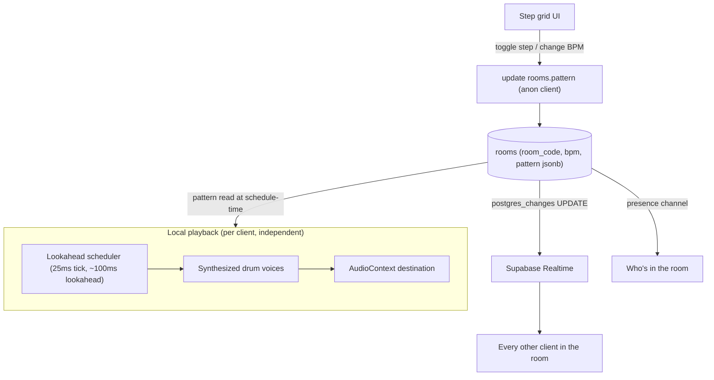

# LoopSync

[](https://github.com/urielabin/loopsync/actions/workflows/ci.yml)
[](LICENSE)

A mini collaborative browser step-sequencer. Synthesized drum voices (no sample assets), sample-accurate lookahead scheduling, and live shared pattern editing over Supabase Realtime. No accounts — create a room, share the code.

## Architecture



## Stack

| Layer | Technology |
|---|---|
| Frontend | Vite + React 18 + TypeScript (strict) + Tailwind |
| Routing | react-router-dom |
| DB + Realtime | Supabase (Postgres, `postgres_changes`, Presence) — no accounts, anon role only |
| Audio | Web Audio API — synthesized voices, no sample files |
| Testing | Vitest (unit + real integration against local Supabase), Playwright (two-browser-context e2e) |
| CI | GitHub Actions + Supabase CLI's local dev stack |

## Design decisions

- **Pure logic vs. AudioNode wiring, kept separate.** `src/audio/scheduler.ts` and `src/audio/voices/*.ts` are plain functions with zero `AudioContext` dependency — state-in/state-out for the scheduler, envelope breakpoints for each voice — so they're unit-tested directly. `src/audio/engine.ts` is the untested I/O glue that wires those decisions onto real `OscillatorNode`/`AudioBufferSourceNode`/`GainNode` graphs.
- **Synthesized sounds, not samples.** Kick is a pitch-enveloped sine, snare/clap/hi-hat are filtered noise bursts through a `BiquadFilterNode`, the stab is three detuned sawtooth oscillators. Zero external asset dependency, and a better Web Audio API exercise than playing back samples would be.
- **Playback is per-client, not sample-locked.** Only pattern data (steps + BPM) syncs across clients — never raw audio. Each browser schedules and renders its own audio locally from the shared pattern state read at schedule-time. Real cross-device sample-accurate audio sync is a much harder problem (see Ableton Link) and is explicitly out of scope here.
- **Last-write-wins, not CRDT.** Every edit is a full-pattern overwrite on `rooms.pattern`. Two people toggling different steps in the same ~100ms window can clobber each other. A deliberate tradeoff for a casual-jam room with a handful of participants, not an oversight.
- **RLS is deliberately permissive.** `rooms` policies are `using (true)` for select/insert/update — anyone who knows the room code can read and edit it, same as a shared link. No accounts, not for sensitive data.
- **`[auth]` runs locally even though there's no login.** Disabling it in `supabase/config.toml` also suppressed the anon API key from `supabase status`'s output entirely (a CLI behavior, not a design choice) — the auth service is up but genuinely unused; no login flow exists anywhere in this app.

## Commands

```bash
npm install
npx supabase start          # local Postgres/Realtime via Docker
npx playwright install --with-deps chromium
npm run dev                 # vite dev server
npm test                    # unit tests (no DB needed)
npm run test:integration    # real RLS checks against real local Supabase
npm run test:e2e            # Playwright, two browser contexts, against a built+previewed app
npm run lint
npm run typecheck
npm run build
```

Copy the values `supabase start` prints into `.env.local`: `API_URL` → `VITE_SUPABASE_URL`, `ANON_KEY` → `VITE_SUPABASE_ANON_KEY`.

## CI — what's real

| | Runs for real |
|---|---|
| `test` | Lint, typecheck, unit tests (scheduler, all 5 voice envelopes, room-code generator — 15 tests), build — no external services |
| `integration` | Real inserts/updates against a real local Postgres instance (`supabase start` in CI) — proves two unrelated anonymous clients can both read and write the same room, confirming the intentionally-permissive RLS behaves as designed |
| `e2e-smoke` | Two separate Playwright browser contexts join the same real room; one toggles a step, the other's grid is asserted to update live with no reload — proves the Realtime subscription actually delivers the change, not just that the write succeeded |

Nothing here is mocked.
